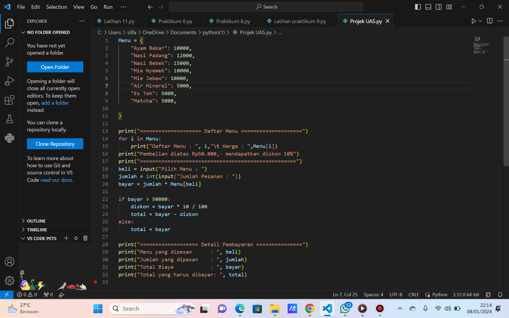
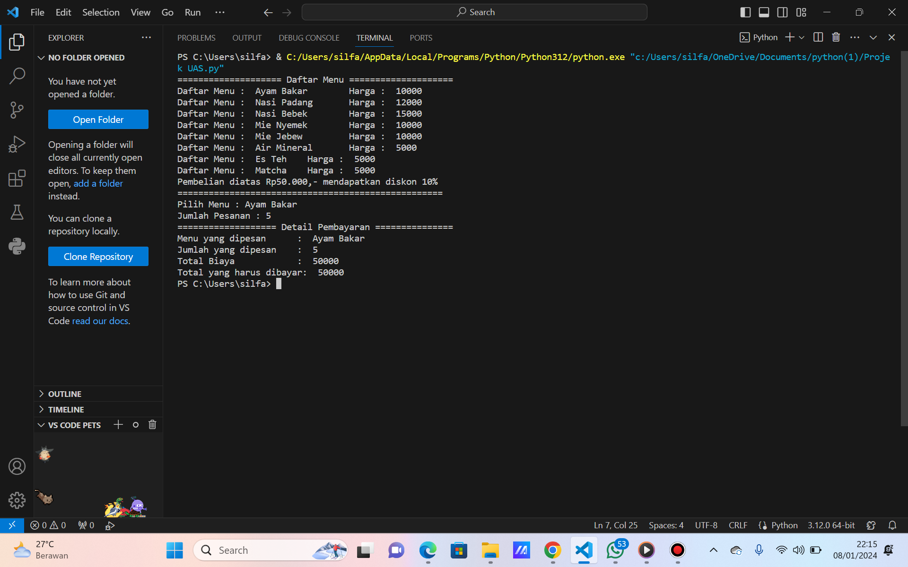

# Projek_UAS

## Profil
| Variable | Isi |
| -------- | --- |
| **Nama** | Silfa Salsa BIla Putri |
| **NIM** | 312310607 |
| **Kelas** | TI.23.A6 |
| **Mata Kuliah** | Bahasa Pemrograman |
| **Link vidio Penjelasan** | https://youtu.be/2HwxoxQ1KTA?si=57CnzqsM9mo0_PKn |

# Langkah-langkah Program
1. Program mulai dengan mendefinisikan dictionary Menu yang berisi daftar makanan beserta harganya.
2. Kemudian, program mencetak daftar menu beserta harganya menggunakan loop for dan print.
3. Setelah mencetak daftar menu, program mencetak informasi tentang diskon yang diberikan jika total pembelian lebih dari Rp50.000.
4. Pengguna diminta untuk memilih menu yang diinginkan dengan menggunakan input untuk memasukkan nama menu yang dipilih.
5. Pengguna juga diminta untuk memasukkan jumlah pesanan menu tersebut.
6. Program menghitung total harga pesanan dengan cara mengalikan harga satu item dengan jumlah pesanan yang dimasukkan pengguna.
7. Selanjutnya, program memeriksa apakah total harga pesanan melebihi Rp50.000. Jika iya, maka diskon sebesar 10% diberikan dan total harga yang harus dibayar dikurangi dengan diskon tersebut. Jika tidak, total pembayaran tetap sama dengan total harga pesanan.
8. Terakhir, program mencetak struk pembayaran yang berisi informasi pesanan, jumlah yang dipesan, total biaya sebelum diskon, dan total yang harus dibayar setelah diskon

# Kode Program

